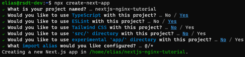

## Creating a Docker Image with Docker Compose

Now that you are familiar with Docker and Nginx, we will go over the process of dockerizing a Next.js application.  

### Steps

1. Create a Next.js application in a project root directory:  

    ```bash
    npx create-next-app
    ```

    You will need to pick a name for your application and specify a few preferences as shown below:  

    

2. Navigate to the `nextjs-nginx-tutorial` directory, then create a `client` directory.  

    Move all files and directories to the `client` directory.  

3. Create an `nginx` directory under the `nextjs-nginx-tutorial` directory.  

    Navigate to the `nginx` directory.  

    Create a `nginx.conf` file in the same directory using the text editor of your choice and paste the following content:  

    ```conf
    server {
        listen          8080;
        server_name     localhost;

        location / {
            proxy_pass        http://client:3000/;
            proxy_redirect    default;
            proxy_set_header  Host $host;
            proxy_set_header  Upgrade $http_upgrade;
            proxy_set_header  Connection "upgrade";
            proxy_set_header  X-Real-IP $remote_addr;
            proxy_set_header  X-Forwarded-For $proxy_add_x_forwarded_for;
            proxy_set_header  X-Forwarded-Host $server_name;
            proxy_set_header  X-Forwarded-Proto $scheme;
        }
    }
    ```

    This is an Nginx configuration. We want the content to be served from the Nginx server's [`localhost:8080`](http://localhost:8080) and we want the root (`/`) of `localhost:8080` to serve contents in the `client` container's port 3000.  

    Then create a `Dockerfile` using the text editor of your choice and paste the following content:  

    ```Dockerfile
    FROM nginx:1.23.3-alpine
    RUN rm /etc/nginx/conf.d/default.conf
    COPY ./nginx.conf /etc/nginx/conf.d
    ```

    A [`Dockerfile`](https://docs.docker.com/engine/reference/builder) is a text document that contains all the commands a user could call on the command line to assemble an image. In the `Dockerfile` above, we instruct Docker to retrieve the official Nginx image, then remove the `default.conf` and copy `nginx.conf` from local to the image's `/etc/nginx/conf.d` directory.  

4. Navigate back to `nextjs-nginx-tutorial` directory.  

    Create a `docker-compose.yaml` file in the same directory using the text editor of your choice and paste the following content:  

    ```yaml
    services:
        client:
            build: ./client/
            ports:
                - 3000
            volumes:
                - ./client/:/client
                - /client/node_modules

        nginx:
            build: ./nginx/
            ports:
                - "8080:8080"
            depends_on:
                - client
    ```

    The Compose file defines the services, networks and volumes used for a Docker application. In the example above, we're creating two services, `client` and `nginx`. In the `client` container, we're using the `build` attribute to indicate the instructions to build the container image (i.e. a `Dockerfile`) can be found in the `client` directory, which we will talk about it in the next step, and that this container will publish its port 3000.  

    In the `nginx` container, we indicate the container's port 8080 will be published to the port 8080 of our local machine and this container image will only be built after the `client` is successfully built.  

5. Navigate to the `client` directory.  

    Create a `Dockerfile` using the text editor of your choice and paste the following content:  

    ```Dockerfile
    FROM node:16-alpine
    WORKDIR /client
    COPY . /client/
    RUN npm install
    EXPOSE 3000
    CMD npm run dev
    ```

    In the `Dockerfile` above, we instruct Docker to retrieve the official Node.js image with the Alpine Linux distro. Alpine Linux is a very lightweight Linux distro focused on security and a small file size. We then set our working directory and copy over our project files to our image. Next, we run `npm install` to install all the project dependencies. Finally, we expose the listening port (i.e. port 300) and issue the `npm run dev` command to start the container from our image.  

6. Run the resulting containers!  

    Run the following command in the directory containing the `docker-compose.yaml` file.  

    ```bash
    docker-compose -p <container-name> up --build
    ```
