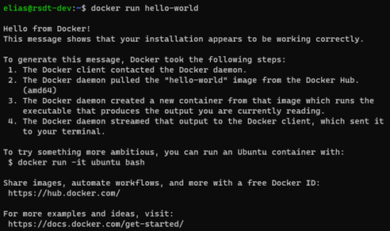
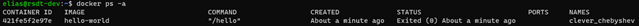

## Running Your First Container

With Docker installed, you can start by running your first container.  

Open a terminal window and enter the following command:  

```bash
docker run hello-world
```

You will be presented with the following response:  



The `hello-world` image is a minimal container that has a single program that print the message shown above in the terminal window.  

To view all container that are currently running or have run in the past, use the following command:  

```bash
docker ps -a
```



Notice that the first column shows the container id (`421fe5f2e97e`) and that the status column shows that the container exited about a minute with status code (`0`) indicating that there were no error produced during the container runtime.  

Let's go over what happened after running the `docker run hello-world` command:  

1. The Docker client reaches out to the daemon which in turn gets the `hello-world` image and runs a container from that.  
2. Since the `hello-world` image cannot be found on the local machine, the `Unable to find image 'hello-world:latest'` message is printed to the console.  
3. The daemon connects to the default public registry, i.e., Docker Hub and pulls the latest version of the `hello-world` image.  
4. The Docker daemon creates a new container form the pulled image and then runs the container.  
