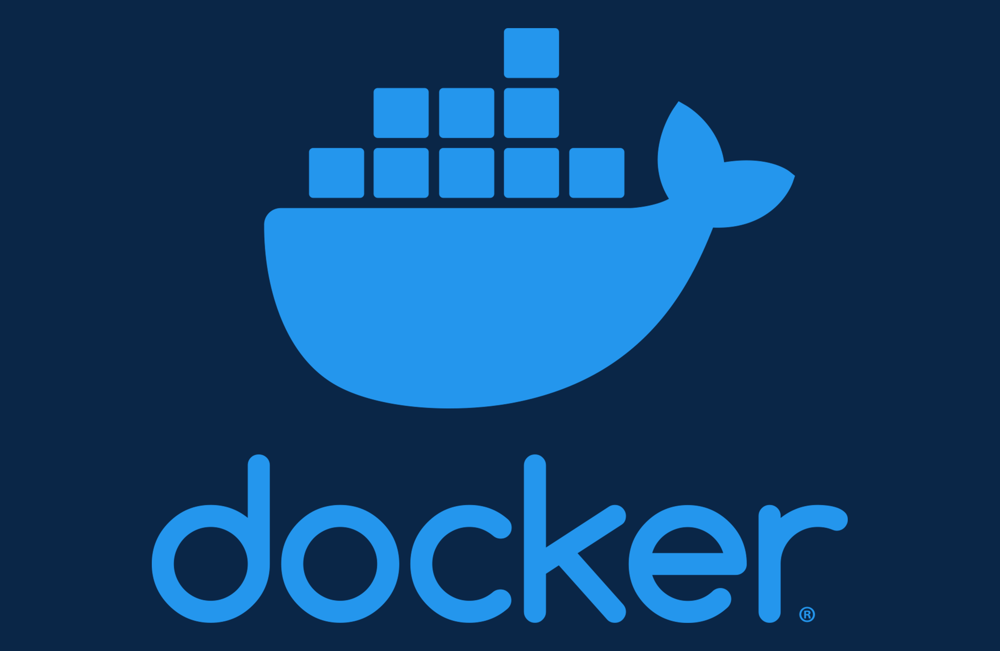

## Docker Basic for Web Development

_Image retrieved from [howtogeek.com](https://www.howtogeek.com/733522/docker-for-beginners-everything-you-need-to-know/)_

The workshop intends to provide guidance on how to utilize one of the most popular container and containers orchestration technology, Docker and Docker Compose. The following guide [Intro to Docker - Intro to Docker (ubc-library-rc.github.io)](https://ubc-library-rc.github.io/intro-docker/) provides a good overview of virtualization, containers, and Docker. The guide does not delve into the technicalities of setting up Docker. However, the guide provides links to several Docker tutorials and activities aimed at beginners. We could potentially use these tutorials as a basis to add more technical information and step-by-step tutorials to the "Intro to Docker" guide.  

The tutorial will only focus on setting up and using Docker on Linux.  
